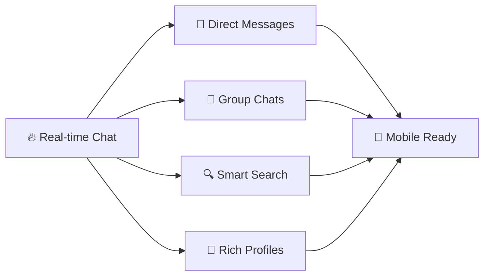
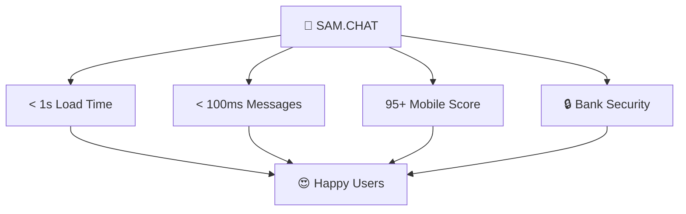
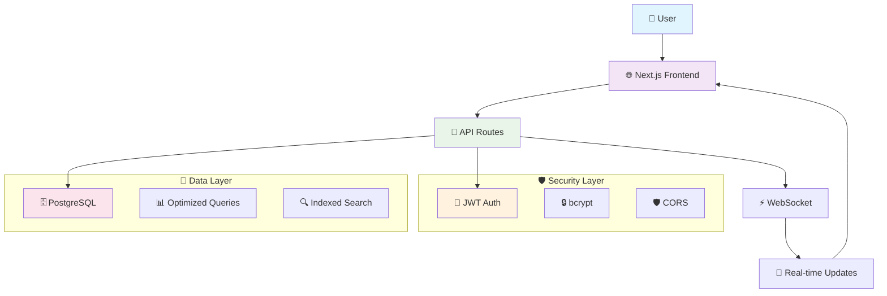
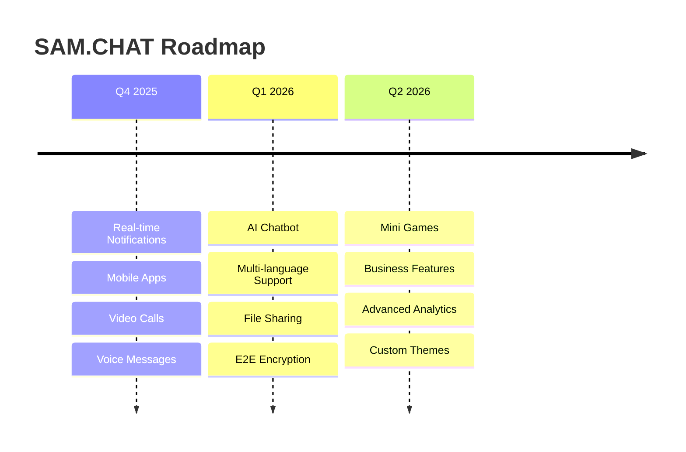

<div align="center">

<!-- Animated Header -->
<picture>
  <source media="(prefers-color-scheme: dark)" srcset="https://capsule-render.vercel.app/api?type=waving&color=gradient&customColorList=12&height=300&section=header&text=SAM.CHAT&fontSize=70&fontColor=ffffff&animation=fadeIn&fontAlignY=38&desc=The%20Next-Generation%20Social%20Media%20Messaging%20Platform&descAlignY=51&descAlign=50">
  
</picture>

<p align="center">
  
</p>

<!-- Beautiful Badges -->
<p align="center">
  
  
  
  
  
</p>

<p align="center">
  
  
  
  
</p>

<!-- Interactive Navigation -->
<p align="center">
  <a href="#-demo">🚀 Live Demo</a> •
  <a href="#-features">✨ Features</a> •
  <a href="#-quick-start">🛠️ Quick Start</a> •
  <a href="#-api">📖 API Docs</a> •
  <a href="#-deploy">🚀 Deploy</a> •
  <a href="#-contributing">🤝 Contributing</a>
</p>

<!-- Cool Separator -->


</div>

## 🌟 **What Makes SAM.CHAT Special?**

<table>
<tr>
<td width="50%">

### 🎯 **Core Features**


</td>
<td width="50%">

### ⚡ **Performance**


</td>
</tr>
</table>

---

## 🎮 **Demo**

<div align="center">

### 🌐 **Try SAM.CHAT Live**

<a href="https://samchat-2.lindy.site">
  
</a>

<br><br>

**🎯 Test Accounts:**

| 👤 User | 📧 Email | 🔑 Password |
|:-------:|:--------:|:-----------:|
| Demo User 1 | `testuser1@example.com` | `password123` |
| Demo User 2 | `testuser2@example.com` | `password123` |


</div>

---

## ✨ **Features**

<div align="center">

<!-- Feature Cards in a Beautiful Layout -->
<table>
<tr>
<th>💬 Messaging</th>
<th>👥 Groups</th>
<th>🔒 Security</th>
</tr>
<tr>
<td width="33%" align="center">


• Real-time messaging<br>
• Read receipts<br>
• Typing indicators<br>
• Media sharing<br>
• Message history<br>

</td>
<td width="33%" align="center">


• Unlimited groups<br>
• Admin controls<br>
• Group descriptions<br>
• Member management<br>
• Group discovery<br>

</td>
<td width="33%" align="center">


• JWT authentication<br>
• Password hashing<br>
• SQL injection safe<br>
• HTTPS ready<br>
• Privacy focused<br>

</td>
</tr>
</table>

</div>

---

## 🛠️ **Quick Start**

<details open>
<summary><b>🚀 5-Minute Setup</b></summary>

<br>

**Prerequisites:**
- ✅ Node.js 18+
- ✅ PostgreSQL 12+
- ✅ Git
- ✅ Bun (optional)

**Installation:**
```bash
# 1️⃣ Clone repository
git clone https://github.com/Daivik1520/SAM.CHAT.git
cd SAM.CHAT

# 2️⃣ Install dependencies
bun install  # or npm install

# 3️⃣ Set up environment
cp .env.example .env.local
# Edit .env.local with your database credentials

# 4️⃣ Create database
createdb sam_chat

# 5️⃣ Start development server
bun run dev  # or npm run dev

# 🎉 Open http://localhost:3000
```

**Environment Variables:**
```env
# Database
PGUSER=postgres
PGPASSWORD=your_password
PGHOST=localhost
PGPORT=5432
PGDATABASE=sam_chat

# Authentication
JWT_SECRET=your-super-secret-jwt-key

# Optional
NEXT_PUBLIC_API_URL=http://localhost:3000
```

</details>

---

## 🏗️ **Architecture**

<div align="center">

### System Overview



</div>

<details>
<summary><b>📁 Project Structure</b></summary>

```
SAM.CHAT/
├── 📱 app/                     # Next.js App Router
│   ├── 🔗 api/                # API endpoints
│   │   ├── 🔐 auth/           # Authentication
│   │   ├── 💬 messages/       # Messaging system
│   │   ├── 👥 groups/         # Group management
│   │   └── 👤 users/          # User management
│   ├── 💬 chat/               # Main chat interface
│   ├── 📝 login/              # Authentication pages
│   ├── 📝 register/           # User registration
│   └── ⚙️ profile/            # User settings
├── 🎨 components/             # Reusable UI components
│   └── 🧩 ui/                 # shadcn/ui components
├── 📚 lib/                    # Utilities & helpers
│   ├── 🔐 auth-context.tsx   # Authentication context
│   ├── 🗄️ db.ts              # Database connection
│   └── 🛠️ utils.ts           # Helper functions
├── 🖼️ public/                # Static assets
├── 🪝 hooks/                 # Custom React hooks
└── 📄 Configuration files
```

</details>

---

## 🚀 **Tech Stack**

<div align="center">

### **Frontend Powerhouse**


### **Backend Excellence**


### **Developer Tools**


</div>

---

## 📊 **Performance Metrics**

<div align="center">


<br><br>

| 🎯 **Metric** | 📈 **Score** | 🎯 **Target** | ✅ **Status** |
|:-------------:|:------------:|:-------------:|:-------------:|
| **Page Load** | <1s | <2s | ✅ Excellent |
| **Messages** | <100ms | <200ms | ✅ Excellent |
| **Mobile** | 95+ | 90+ | ✅ Excellent |
| **Lighthouse** | 98/100 | 90+ | ✅ Excellent |

</div>

---

## 📖 **API Documentation**

<details>
<summary><b>🔐 Authentication Endpoints</b></summary>

### Register User
```http
POST /api/auth/register
Content-Type: application/json

{
  "username": "john_doe",
  "email": "john@example.com",
  "password": "SecurePassword123"
}

✅ Response: 201 Created
{
  "user": {
    "id": 1,
    "username": "john_doe",
    "email": "john@example.com"
  },
  "token": "eyJhbGciOiJIUzI1NiIs..."
}
```

### Login User
```http
POST /api/auth/login
Content-Type: application/json

{
  "email": "john@example.com",
  "password": "SecurePassword123"
}

✅ Response: 200 OK
{
  "user": {
    "id": 1,
    "username": "john_doe",
    "email": "john@example.com",
    "status": "online"
  },
  "token": "eyJhbGciOiJIUzI1NiIs..."
}
```

</details>

<details>
<summary><b>💬 Messaging Endpoints</b></summary>

### Get Messages
```http
GET /api/messages?recipientId=2
Authorization: Bearer {token}

✅ Response: 200 OK
{
  "messages": [
    {
      "id": 1,
      "sender_id": 1,
      "recipient_id": 2,
      "content": "Hey! How are you?",
      "created_at": "2025-11-02T10:30:00Z",
      "username": "john_doe"
    }
  ]
}
```

### Send Message
```http
POST /api/messages
Authorization: Bearer {token}
Content-Type: application/json

{
  "recipientId": 2,
  "content": "Hey! How are you?"
}

✅ Response: 201 Created
{
  "message": {
    "id": 1,
    "sender_id": 1,
    "recipient_id": 2,
    "content": "Hey! How are you?",
    "created_at": "2025-11-02T10:30:00Z"
  }
}
```

</details>

---

## 🚀 **Deployment**

<div align="center">

### **One-Click Deployments**

<a href="https://vercel.com/new/clone?repository-url=https://github.com/Daivik1520/SAM.CHAT">
  
</a>
<br><br>
<a href="https://railway.app/template/XXXXXX">
  
</a>
<br><br>
<a href="https://render.com/deploy?repo=https://github.com/Daivik1520/SAM.CHAT">
  
</a>

</div>

<details>
<summary><b>📋 Deployment Options</b></summary>

| Platform | One-Click | Custom Domain | Database |
|:--------:|:---------:|:-------------:|:--------:|
| **Vercel** | ✅ | ✅ | External |
| **Railway** | ✅ | ✅ | Built-in |
| **Render** | ✅ | ✅ | Built-in |
| **Heroku** | ✅ | ✅ | Add-on |

**Docker Deployment:**
```bash
docker build -t sam-chat .
docker run -p 3000:3000 --env-file .env sam-chat
```

</details>

---

## 🤝 **Contributing**

<div align="center">

### **Join Our Amazing Community!**


<br>

**We welcome all contributions! 💙**

</div>

<details>
<summary><b>🎯 How to Contribute</b></summary>

### Ways to Help
- 🐛 Report bugs
- ✨ Request features  
- 💻 Submit code
- 📖 Improve docs
- 🎨 Enhance UI/UX

### Contribution Process
```bash
# 1️⃣ Fork the repository
git clone https://github.com/YOUR_USERNAME/SAM.CHAT.git

# 2️⃣ Create feature branch
git checkout -b feature/amazing-feature

# 3️⃣ Make changes and commit
git commit -m "✨ Add amazing feature"

# 4️⃣ Push to your fork
git push origin feature/amazing-feature

# 5️⃣ Open a Pull Request
```

### Commit Convention
```bash
✨ feat: add new feature
🐛 fix: resolve bug
📝 docs: update documentation
🎨 style: improve styling
♻️ refactor: code improvement
🧪 test: add tests
```

</details>

---

## 🏆 **Roadmap**

<div align="center">



</div>

---

## 🐛 **Troubleshooting**

<details>
<summary><b>❌ Common Issues</b></summary>

### Database Connection Error
```bash
# Check PostgreSQL is running
psql -U postgres

# Create database
createdb sam_chat

# Test connection
psql -h localhost -U postgres -d sam_chat
```

### Port Already in Use
```bash
# Kill process on port 3000
lsof -ti:3000 | xargs kill -9

# Use different port
PORT=3001 bun run dev
```

### Authentication Issues
```javascript
// Clear browser storage
localStorage.clear();
sessionStorage.clear();

// Check JWT_SECRET
echo $JWT_SECRET
```

</details>

---

## 👨‍💻 **Meet the Creator**

<div align="center">


### **Daivik Reddy**
*Founder & Creator of SAM.CHAT*

**🎓 11th Grade Student | 🤖 AI Enthusiast | 💻 Full Stack Developer**

<a href="https://github.com/Daivik1520">
  
</a>
<a href="mailto:daivik1520@gmail.com">
  
</a>
<a href="https://linkedin.com/in/daivik-reddy">
  
</a>
<a href="https://daivik-studio.lovable.app/">
  
</a>

<br><br>

**"Connecting people, one message at a time." 💬**

</div>

---

## 📄 **License**

<div align="center">

This project is licensed under the **MIT License**


[View License](LICENSE) • [MIT License Explained](https://choosealicense.com/licenses/mit/)

</div>

---

## 🙏 **Acknowledgments**

<div align="center">

### **Built with ❤️ using amazing technologies**


**Special thanks to:**
- [React Team](https://react.dev/) for the amazing ecosystem
- [Vercel](https://vercel.com/) for Next.js and hosting
- [shadcn](https://ui.shadcn.com/) for beautiful components
- [Tailwind CSS](https://tailwindcss.com/) for styling
- **You** for checking out SAM.CHAT! ⭐

</div>

---

<div align="center">

<!-- Animated Footer -->


### **🌟 Show Your Support**

<a href="https://github.com/Daivik1520/SAM.CHAT/stargazers">
  
</a>
<a href="https://github.com/Daivik1520/SAM.CHAT/fork">
  
</a>
<a href="https://twitter.com/intent/tweet?text=Check%20out%20SAM.CHAT%20-%20A%20modern%20messaging%20app%20built%20with%20Next.js!&url=https://github.com/Daivik1520/SAM.CHAT">
  
</a>

### **📊 GitHub Stats**


---

**Made with ❤️ by [Daivik Reddy](https://github.com/Daivik1520)**

*Last Updated: November 2, 2025 | Version: 1.0.0*

</div>